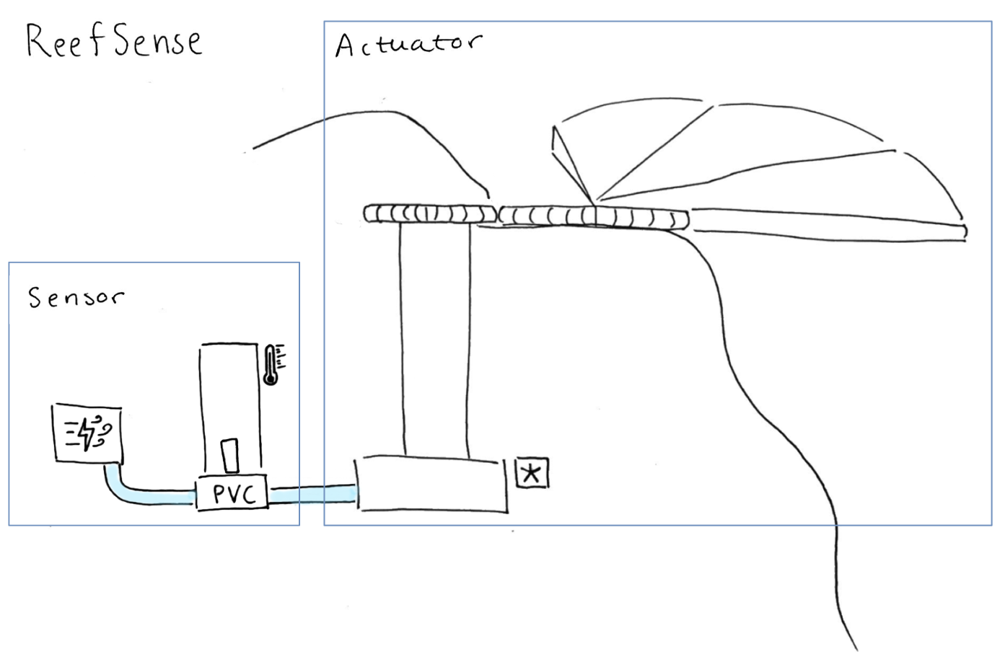

# ReefSense

ReefSense is an HCI bachelor project enabling fabrication of prototypes of a system that integrates sensing and actuation into artificial reefs. The system is intended to respond to an increase in temperature, shading the reef with a parasol. The system is powered by pressurized air and water. The sensor is a thermoscope inspired by a Galilean thermometer, which is not 3D-printable. A pinch valve controller (PVC) controls whether water flows through the system or not. This water flow is transfered into rotational force in a water wheel, which then opens the parasol via gears. 

The project provides 3D-printable models of the system: The parasol, pinch valve controller, gears, and water wheel.

## Remarks on the designs

Several gears are provided. Each file is called gearX.stl, where X denotes the number of teeth on the gear.

The frame for the parasol and the wheel are configured to align in height when the parasol is made up of 4 wings (1 bottom, 2 regular, 1 top). In order to accomodate more wings, both files (parasol/frame.stl and waterwheel/wheel.stl) need to be modified.

## Authors

Linnea Andersen, University of Copenhagen

Sofie Havn, University of Copenhagen
